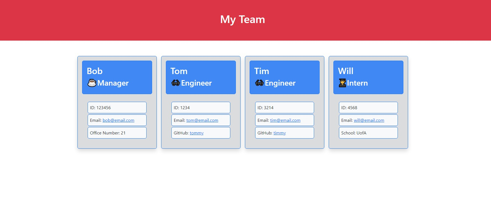

# Team Profile Generator

## Description

This project was created to help solve the problem of organizing a workforce team with all roles, ids, and other necessary details listed. I was motivated to create something that was clean and easy to read, while solving this problem.

## Table of Contents

- [Installation](#installation)
- [Usage](#usage)
- [License](#license)
- [Questions and Contributing](#questions-and-contributing)
- [Tests](#tests)

## Installation

N/A

## Usage

Run "node index" in the terminal. The user is then prompted with a series of questions, starting with choosing a role of manager, engineer, or intern. Once the role is selected, the user is then prompted with questions that would pertain to the respective role. For example, manager has the question of office number, engineer has the question of the GitHub username, and the intern has a question of the school they're attending. Once all roles are filled in, the user can then choose to be finished building their team. At that point, an HTML file is created titled Team.html that the user can then pull up in a browser to view the team structure.

Screenshot:

## License

[The MIT License](https://opensource.org/licenses/MIT)

## Questions and Contributing

If you have any questions, you can contact me by [email](j.mcd.lungren@gmail.com) or through [GitHub](https://github.com/jmcdlungren).

If you are interested in contributing, please follow the guidelines outlined within the [Contributor Covenant](https://www.contributor-covenant.org/).

## Tests

Test.js files are included within the project testing the Employee, Manager, Engineer, and Intern classes. All tests passed.

[Example Test Video of Running Jest](https://drive.google.com/file/d/1GYElq-FL2ovHIzm2Ihgwo5GxQ-LqiRWf/view)

GIF of Example Test of Running Jest:

[Example Test Video of Creating a Team](https://drive.google.com/file/d/1NyfUmtrB-wC-1jtUzJgzUiaiu4wDlFcY/view)

GIF of Example Test of Creating a Team:

